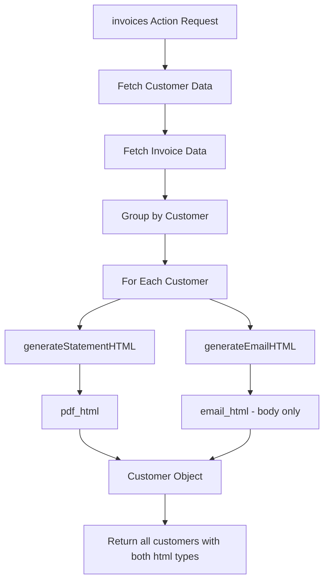

# Plan: Add email_html to Existing invoices Action

## Overview
Add `email_html` as an additional node value returned by the existing `invoices` action. Both `pdf_html` and `email_html` will be generated from the same invoice data for each customer.

## Requirements
Based on user requirements, the email template should include:
- Personalized greeting with customer name
- Statement date
- Summary of outstanding invoices and open credits
- Contact information for accounts@rapidcleanillawarra.com.au and (02) 4256 4477
- Invoice summary table

## Implementation Steps

### Step 1: Create generateEmailHTML function
Add a new function `generateEmailHTML(customer, invoices)` that:
- Generates the email body (no subject line)
- Includes a table of outstanding invoices
- Uses the same invoice data format as the existing PDF generation

**Location**: After `generateStatementHTML` function (around line 438)

**Function structure**:
```javascript
const generateEmailHTML = (customer, invoices) => {
    // Helper function to format currency with commas
    const formatCurrency = (amount) => {
        if (amount === null || amount === undefined) return '0.00';
        const num = parseFloat(amount);
        if (isNaN(num)) return '0.00';
        return num.toLocaleString('en-US', { minimumFractionDigits: 2, maximumFractionDigits: 2 });
    };

    // Format customer name
    const customerName = customer.pdf_customer_name || customer.customer_username || 'Customer';

    // Format date
    const statementDate = new Date().toLocaleDateString('en-AU', {
        day: 'numeric',
        month: 'long',
        year: 'numeric'
    });

    // Generate invoice table rows
    const tableRows = invoices.map((invoice, index) => {
        const orderId = invoice.id;
        const datePlaced = invoice.datePlaced ? new Date(invoice.datePlaced).toLocaleDateString('en-AU', {
            day: 'numeric',
            month: 'short',
            year: 'numeric'
        }) : 'N/A';
        const dueDate = invoice.datePaymentDue ? new Date(invoice.datePaymentDue).toLocaleDateString('en-AU', {
            day: 'numeric',
            month: 'short',
            year: 'numeric'
        }) : 'N/A';
        const orderTotal = invoice.grandTotal ? formatCurrency(invoice.grandTotal) : '0.00';
        const balance = invoice.outstandingAmount ? formatCurrency(invoice.outstandingAmount) : '0.00';

        return `
            <tr>
                <td>${orderId}</td>
                <td>${datePlaced}</td>
                <td>${dueDate}</td>
                <td style="text-align: right;">$${orderTotal}</td>
                <td style="text-align: right;">$${balance}</td>
            </tr>`;
    }).join('');

    const totalBalance = invoices.reduce((sum, inv) => sum + parseFloat(inv.outstandingAmount || 0), 0);

    return `
Hi ${customerName},

Hope you're well.

Please find attached your Open Statement as at ${statementDate}, which lists all currently outstanding (unpaid) invoices and any open credits on your account with RapidClean Illawarra.

If payment has already been processed recently, please disregard this message and accept our thanks.

If you need copies of any invoices, remittance details, or would like to query any item on the statement, please contact us at accounts@rapidcleanillawarra.com.au or call our office on (02) 4256 4477.

Please see below a summary of the outstanding invoices and any open credits currently on your account as at ${statementDate}:

<table style="width: 100%; border-collapse: collapse; margin: 20px 0;">
    <thead>
        <tr style="background-color: #f2f2f2;">
            <th style="padding: 10px; border: 1px solid #ddd; text-align: left;">Order #</th>
            <th style="padding: 10px; border: 1px solid #ddd; text-align: left;">Date Placed</th>
            <th style="padding: 10px; border: 1px solid #ddd; text-align: left;">Due Date</th>
            <th style="padding: 10px; border: 1px solid #ddd; text-align: right;">Order Total</th>
            <th style="padding: 10px; border: 1px solid #ddd; text-align: right;">Balance</th>
        </tr>
    </thead>
    <tbody>
        ${tableRows}
        <tr style="background-color: #f9f9f9; font-weight: bold;">
            <td colspan="4" style="padding: 10px; border: 1px solid #ddd; text-align: right;">Total Outstanding</td>
            <td style="padding: 10px; border: 1px solid #ddd; text-align: right;">$${formatCurrency(totalBalance)}</td>
        </tr>
    </tbody>
</table>

Thank you for your business.

Kind regards,
RapidClean Illawarra Team
    `;
};
```

### Step 2: Modify the invoices action to generate both pdf_html and email_html
Update the section around lines 769-775 to generate both HTML types:

**Current code** (lines 769-775):
```javascript
// Generate PDF HTML for each customer
const customersWithPdfHtml = resultCustomers.map(customer => {
    const pdfHtml = generateStatementHTML(customer, customer.invoices);
    return {
        ...customer,
        pdf_html: pdfHtml
    };
});
```

**New code**:
```javascript
// Generate PDF HTML and Email HTML for each customer
const customersWithPdfHtml = resultCustomers.map(customer => {
    const pdfHtml = generateStatementHTML(customer, customer.invoices);
    const emailHtml = generateEmailHTML(customer, customer.invoices);
    return {
        ...customer,
        pdf_html: pdfHtml,
        email_html: emailHtml
    };
});
```

### Step 3: Update the success message
Update the console log and message to reflect both HTML types:

**Current code** (line 777):
```javascript
console.log(`Returning ${customersWithPdfHtml.length} customers with their invoices and PDF HTML`);
```

**New code**:
```javascript
console.log(`Returning ${customersWithPdfHtml.length} customers with their invoices, PDF HTML, and Email HTML`);
```

### Step 4: Update the return message
Update the success message (line 786):
```javascript
message: 'Customer invoices fetched successfully with PDF and Email HTML'
```

### Step 5: Export the new function
Add `generateEmailHTML` to the module exports (line 831):
```javascript
module.exports = { handler, filterCustomersByBalance, generateStatementHTML, generateEmailHTML };
```

## Output Structure

The `invoices` action will now return each customer with:
```json
{
    "customer_username": "username",
    "email": "customer@email.com",
    "pdf_customer_name": "John Doe (Company)",
    "invoices": [...],
    "pdf_html": "<!DOCTYPE html>...</html>",
    "email_html": "Hi John Doe,\n\nHope you're well.\n\nPlease find attached..."
}
```

## Email Body Template (no Subject)

```
Hi [Customer Name],

Hope you're well.

Please find attached your Open Statement as at [Date], which lists all currently outstanding (unpaid) invoices and any open credits on your account with RapidClean Illawarra.

If payment has already been processed recently, please disregard this message and accept our thanks.

If you need copies of any invoices, remittance details, or would like to query any item on the statement, please contact us at accounts@rapidcleanillawarra.com.au or call our office on (02) 4256 4477.

Please see below a summary of the outstanding invoices and any open credits currently on your account as at [Date]:

[INVOICE TABLE]

Thank you for your business.

Kind regards,
RapidClean Illawarra Team
```

## Mermaid Diagram: Data Flow



## Notes
1. Both `pdf_html` and `email_html` are generated from the same invoice data
2. The `email_html` uses plain text format with embedded HTML table for email client compatibility
3. The Subject line is NOT included in `email_html` - only the body content
4. The formatCurrency helper is duplicated in generateEmailHTML for independence (can be refactored later if needed)
5. Date formatting in email uses Australian format (en-AU locale)
