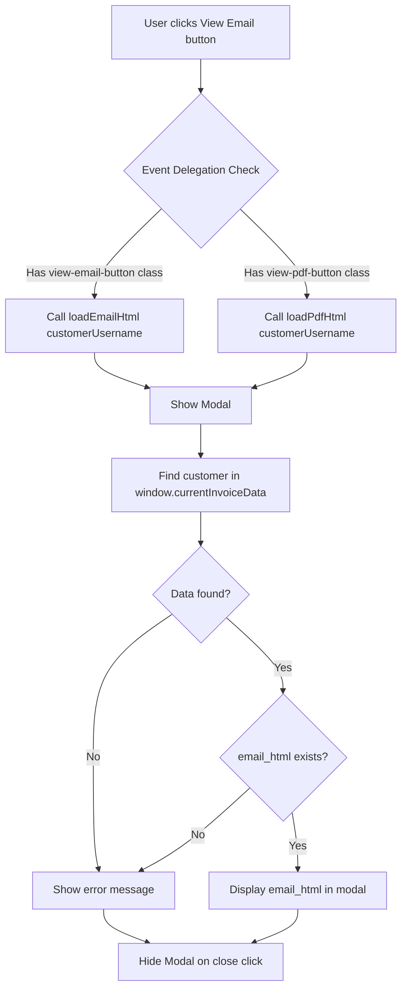

# Plan: Add "View Email" Button to Generate Invoices Statements

## Overview
Add a "View Email" button next to the existing "View PDF" button in `generate_invoices_statements.html`. The button should display the `email_html` content returned from the Netlify function in a modal.

## Current State Analysis

### Existing Implementation
1. **View PDF Button**: Orange gradient button at line 872-874
2. **Modal**: Used for PDF preview (lines 518-536)
3. **PDF Handler**: `loadPdfHtml()` function (lines 605-644)
4. **Data Source**: API returns both `pdf_html` and `email_html` per customer (lines 854-863 in JS)

## Implementation Plan

### Step 1: Add CSS for "View Email" Button
Add new CSS rule for `.view-email-button` in the `<style>` section (around line 455):
- Similar styling to `.view-pdf-button` but with purple gradient
- Consistent padding, border-radius, and hover effects

### Step 2: Add "View Email" Button to HTML
In the `updateInvoicesResults()` function, add the button in the Actions section (around line 872):
- Place it beside the "View PDF" button
- Use `data-customer` attribute for event delegation
- Add `data-action="email"` to distinguish from PDF

### Step 3: Update Modal Header
Modify the modal header dynamically based on content type:
- Show "PDF Preview" when displaying PDF
- Show "Email Preview" when displaying email

### Step 4: Add Email Display Handler
Add a new function `loadEmailHtml()` similar to `loadPdfHtml()`:
- Find customer data from `window.currentInvoiceData`
- Get `email_html` instead of `pdf_html`
- Display in modal (use `innerHTML` directly instead of iframe for email content)

### Step 5: Update Event Delegation
Modify the click handler (lines 597-603) to:
- Check for both `view-pdf-button` and `view-email-button` classes
- Route to appropriate handler based on button class

## File Changes Summary

### `generate_invoices_statements.html`

| Section | Change |
|---------|--------|
| Lines 429-455 (CSS) | Add `.view-email-button` CSS class |
| Lines 871-876 (HTML) | Add `<button class="view-email-button">` |
| Lines 522 (HTML) | Make modal title dynamic |
| Lines 597-644 (JS) | Update event delegation and add `loadEmailHtml()` |

## Mermaid Diagram: Button Click Flow



## Implementation Details

### CSS for View Email Button
```css
.view-email-button {
    background: linear-gradient(135deg, #8b5cf6 0%, #7c3aed 100%);
    color: white;
    border: none;
    padding: 8px 16px;
    font-size: 0.9rem;
    font-weight: 500;
    border-radius: 6px;
    cursor: pointer;
    transition: all 0.3s ease;
    box-shadow: 0 2px 8px rgba(139, 92, 246, 0.3);
    margin-left: 10px;
}

.view-email-button:hover {
    transform: translateY(-1px);
    box-shadow: 0 4px 12px rgba(139, 92, 246, 0.4);
}

.view-email-button:disabled {
    background: #9ca3af;
    cursor: not-allowed;
    transform: none;
    box-shadow: none;
}
```

### Updated Event Delegation
```javascript
document.addEventListener('click', async (e) => {
    if (e.target.classList.contains('view-pdf-button')) {
        const customerUsername = e.target.dataset.customer;
        await loadPdfHtml(customerUsername);
    } else if (e.target.classList.contains('view-email-button')) {
        const customerUsername = e.target.dataset.customer;
        await loadEmailHtml(customerUsername);
    }
});
```

### New loadEmailHtml Function
```javascript
async function loadEmailHtml(customerUsername) {
    showModal();
    pdfLoading.style.display = 'block';
    pdfError.style.display = 'none';
    pdfContent.style.display = 'none';
    document.querySelector('.modal-header h2').textContent = 'Email Preview';

    try {
        const customerData = window.currentInvoiceData?.customers?.find(
            c => c.customer_username === customerUsername
        );

        if (!customerData) {
            throw new Error('Customer data not found. Please refresh the page.');
        }

        if (!customerData.email_html) {
            throw new Error('Email content not available for this customer.');
        }

        pdfContent.innerHTML = `<pre style="padding: 20px; white-space: pre-wrap; font-family: monospace;">${customerData.email_html}</pre>`;
        
        pdfLoading.style.display = 'none';
        pdfContent.style.display = 'block';

    } catch (error) {
        console.error('Error displaying email:', error);
        pdfErrorText.textContent = error.message;
        pdfLoading.style.display = 'none';
        pdfError.style.display = 'block';
    }
}
```

### Updated loadPdfHtml to Reset Modal Title
Add at the start of `loadPdfHtml()`:
```javascript
document.querySelector('.modal-header h2').textContent = 'PDF Preview';
```

## Testing Checklist
- [ ] Verify "View Email" button appears beside "View PDF" button
- [ ] Verify button styling is consistent with existing button
- [ ] Verify clicking "View Email" opens the modal
- [ ] Verify modal shows "Email Preview" title
- [ ] Verify email HTML content displays correctly
- [ ] Verify error handling when email_html is not available
- [ ] Verify modal close functionality works
- [ ] Verify both buttons can be used interchangeably

## Estimated Complexity
- Low: Straightforward addition of button and handler
- No API changes needed (email_html already returned)
- Minimal CSS additions
