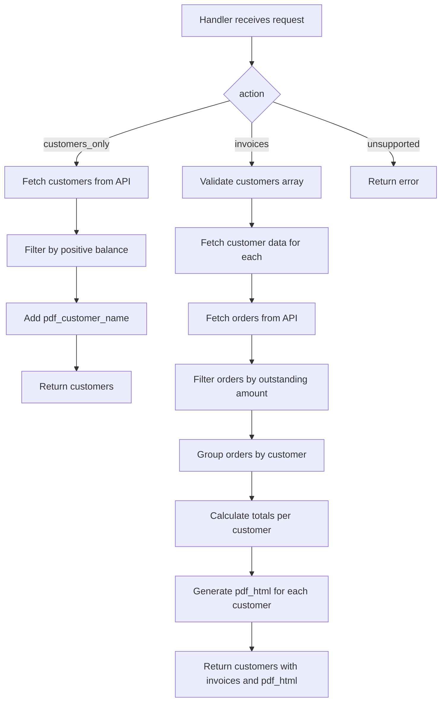

# Plan: PDF HTML Node Integration and Action Streamlining

## Overview
Modify `netlify/functions/statement_of_accounts/generate_invoices_statements.js` to:
1. Add a `pdf_html` node within the `invoices` action that captures `generateStatementHTML` output
2. Streamline actions to retain only `customer_only` and `invoices` (removing `generate_pdf_html`)

## Current State Analysis

### Existing Actions:
1. **`customers_only`** (line 499) - Fetches customer data from Power Automate API
2. **`invoices`** (line 570) - Fetches invoices for specified customers
3. **`generate_pdf_html`** (line 766) - Generates PDF HTML for a specific customer using `generateStatementHTML`

### Required Changes:
- Keep: `customers_only` and `invoices` actions only
- Remove: `generate_pdf_html` action
- Integrate: `pdf_html` node within `invoices` action

## Implementation Steps

### Step 1: Modify the `invoices` action (line 570-765)
Add a `pdf_html` node that captures the output from `generateStatementHTML` for each customer.

**Current flow:**
```
invoices action:
  → Fetch customer data
  → Fetch orders
  → Process and group orders by customer
  → Return customers with invoices
```

**New flow:**
```
invoices action:
  → Fetch customer data
  → Fetch orders
  → Process and group orders by customer
  → Generate PDF HTML for each customer (new pdf_html node)
  → Return customers with invoices AND pdf_html
```

### Step 2: Add PDF HTML generation within `invoices` action
After processing orders for each customer, generate the HTML and store it in a new `pdf_html` property.

**Location:** After line 745-748 where `resultCustomers` is created, before the return statement at line 754.

**New code structure:**
```javascript
// Generate PDF HTML for each customer
const customersWithPdfHtml = resultCustomers.map(customer => {
    const pdfHtml = generateStatementHTML(customer, customer.invoices);
    return {
        ...customer,
        pdf_html: pdfHtml
    };
});

// Convert to array
const resultCustomers = customersWithPdfHtml.map(customer => ({
    ...customer,
    invoices: customer.invoices
}));
```

### Step 3: Update the return statement (line 754-765)
Update the return to include the customers with `pdf_html` generated.

**Current return:**
```javascript
return {
    statusCode: 200,
    headers,
    body: JSON.stringify({
        success: true,
        message: 'Customer invoices fetched successfully',
        customers: resultCustomers,
        requested_customers: customers,
        valid_customers: validCustomers,
        timestamp
    })
};
```

**New return:**
```javascript
return {
    statusCode: 200,
    headers,
    body: JSON.stringify({
        success: true,
        message: 'Customer invoices fetched successfully',
        customers: customersWithPdfHtml,
        pdf_html: customersWithPdfHtml.map(c => ({
            customer_username: c.customer_username,
            pdf_html: c.pdf_html
        })),
        requested_customers: customers,
        valid_customers: validCustomers,
        timestamp
    })
};
```

### Step 4: Remove the `generate_pdf_html` action (line 766-816)
Delete the entire `generate_pdf_html` action block.

### Step 5: Update the unsupported actions error message (line 817-827)
Update the supported actions list to reflect the streamlined actions.

**Current:**
```javascript
message: 'Supported actions: "customers_only", "invoices", "generate_pdf_html"'
```

**New:**
```javascript
message: 'Supported actions: "customers_only", "invoices"'
```

## Code Flow Diagram



## Files to Modify
- `netlify/functions/statement_of_accounts/generate_invoices_statements.js`

## Summary of Changes
1. **Lines 745-748:** Add PDF HTML generation for each customer after processing orders
2. **Lines 754-765:** Update return statement to include pdf_html in response
3. **Lines 766-816:** Remove the `generate_pdf_html` action block
4. **Line 825:** Update supported actions message
