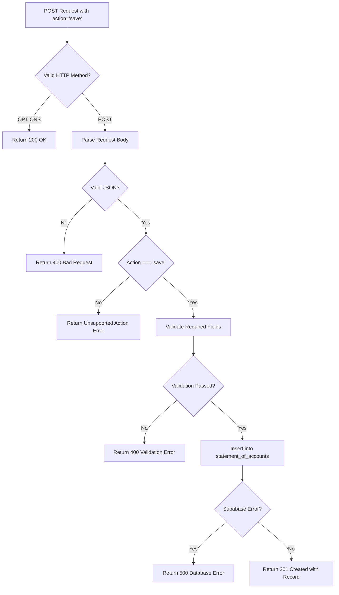

# Save Action Implementation Plan

## Overview
Add a new `save` action to the [`generate_invoices_statements.js`](../netlify/functions/statement_of_accounts/generate_invoices_statements.js:1) Netlify function that saves statement of account records to the Supabase `statement_of_accounts` table.

## Request Payload
```json
{
  "action": "save",
  "customer_username": "8fAg4k3heFmec5p",
  "sent": true,
  "pdf_link": "https://rapidcleanillawarra-my.sharepoint.com/...",
  "bounced": false,
  "customer_email": "wollongong@inmotiongroup.com.au"
}
```

## Database Schema
```sql
create table public.statement_of_accounts (
  id uuid not null default gen_random_uuid (),
  customer_username text not null,
  sent boolean not null default false,
  pdf_link text null,
  bounced boolean null,
  customer_email text null,
  created_at timestamp with time zone not null default now(),
  constraint statement_of_accounts_pkey primary key (id)
);
```

## Implementation Steps

### Step 1: Add Input Validation
Add validation for the required and optional fields:
- `customer_username` (required): Must be a non-empty string
- `sent` (required): Must be a boolean
- `pdf_link` (optional): String or null
- `bounced` (optional): Boolean or null
- `customer_email` (optional): String or null

### Step 2: Add Supabase Insert Operation
```javascript
const { data, error } = await supabase
    .from('statement_of_accounts')
    .insert({
        customer_username,
        sent,
        pdf_link: pdf_link || null,
        bounced: bounced !== undefined ? bounced : null,
        customer_email: customer_email || null
    })
    .select('id, customer_username, created_at')
    .single();
```

### Step 3: Add Response Handling
- Success (201): Return the created record with id and created_at
- Validation Error (400): Return clear error messages
- Database Error (500): Return Supabase error details

### Step 4: Update Supported Actions
Update line 542 to include "save" in the list of supported actions.

## File Modifications
- **File**: `netlify/functions/statement_of_accounts/generate_invoices_statements.js`
- **Insertion Point**: After line 533 (end of `start` action block)
- **Estimated Lines**: ~40-50 lines of code

## Data Flow


## Testing Scenarios
1. Valid payload with all fields
2. Missing required fields (customer_username, sent)
3. Invalid field types
4. Null/undefined optional fields
5. Database insertion errors

## Success Criteria
- The "save" action accepts the specified payload
- Records are successfully inserted into the statement_of_accounts table
- Appropriate error responses are returned for invalid inputs
- Existing functionality (customers_only, invoices, start actions) remains unaffected
